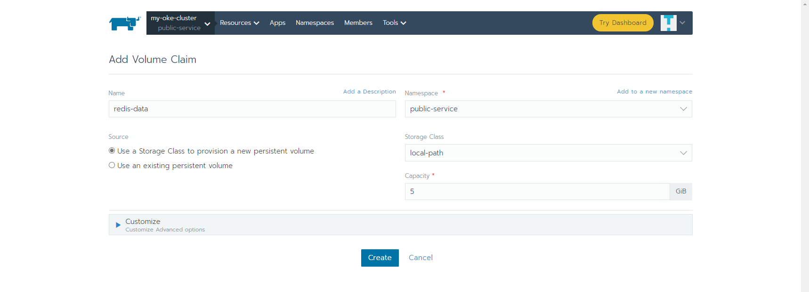

### Add config

```
apiVersion: v1
data:
  redis.conf: |-
    dir /data
    port 6379
    bind 0.0.0.0
    appendonly yes
    protected-mode no
    replica-read-only no
    slave-read-only no
    pidfile /data/redis-6379.pid
kind: ConfigMap
metadata:
  labels:
    app: redis
  name: redis-config
  namespace: public-service
```

### Add Volumes



### Add Workloads

```
## Service
apiVersion: v1
kind: Service
metadata:
  name: redis
  labels:
    app: redis
spec:
  type: NodePort
  ports:
  - name: redis
    port: 6379
    nodePort: 30379
    targetPort: 6379
  selector:
    app: redis
---
## Deployment
apiVersion: apps/v1
kind: Deployment
metadata:
  name: redis
  labels:
    app: redis
spec:
  replicas: 1
  selector:
    matchLabels:
      app: redis
  template:
    metadata:
      labels:
        app: redis
    spec:     
      containers:
      - name: redis
        image: redis:5.0.8
        ports:
        - containerPort: 6379
        resources:
          limits:
            cpu: 100m
            memory: 100Mi
          requests:
            cpu: 10m
            memory: 50Mi
        livenessProbe:
          tcpSocket:
            port: 6379
          initialDelaySeconds: 300
          timeoutSeconds: 1
          periodSeconds: 10
          successThreshold: 1
          failureThreshold: 3
        readinessProbe:
          tcpSocket:
            port: 6379
          initialDelaySeconds: 5
          timeoutSeconds: 1
          periodSeconds: 10
          successThreshold: 1
          failureThreshold: 3
        volumeMounts:
        - name: data
          mountPath: /data
        - name: config
          mountPath:  /usr/local/etc/redis/redis.conf
          subPath: redis.conf
      volumes:
      - name: data
        persistentVolumeClaim:
          claimName: redis-data
      - name: config      
        configMap:
          name: redis-config
```
